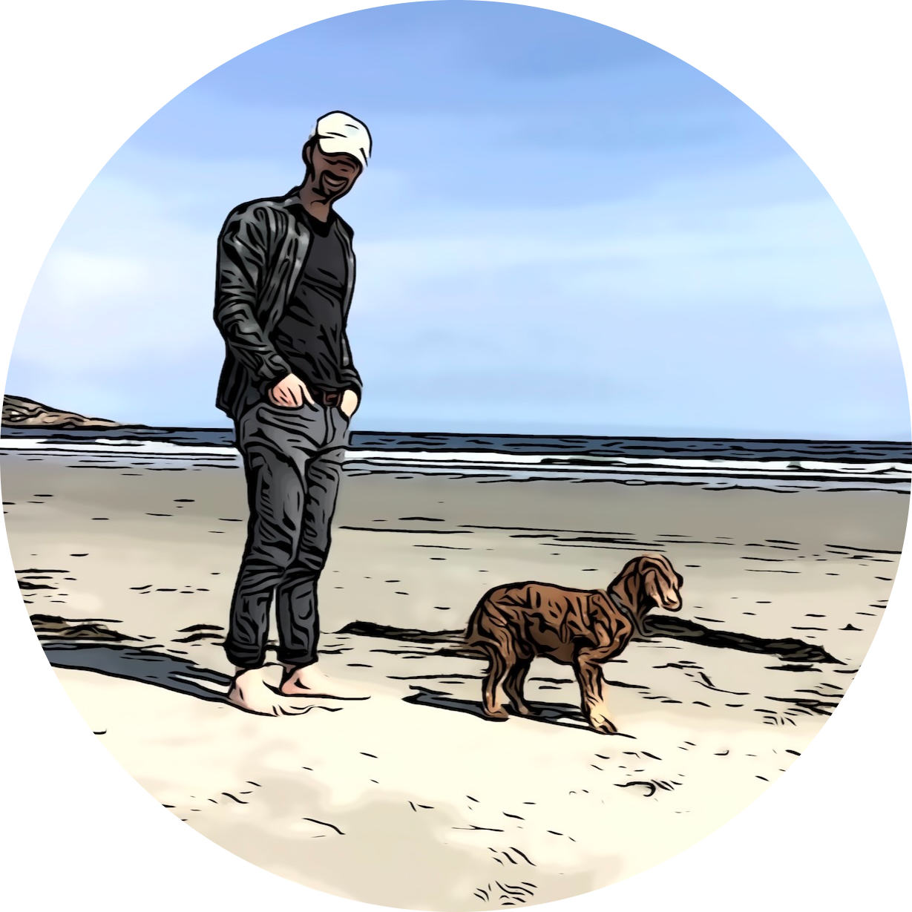

<h2> Hi, I'm Kyle 👋 </h2>

<p><em>I'm currently a Full Stack Developer building a site for <a href="https://preferred-rentals.vercel.app/">Preferred Rentals</a></em></p>

[](https://www.linkedin.com/in/kyle-eriss/)
[](https://github.com/KyleEriss)


A little about me...  

```javascript
const kyle = {
  code: [Javascript, Typescript, HTML, CSS, Python, Java],
  tools: [React, Angular, Node, PostgreSQL, MongoDB, AWS, Terraform, Docker],
  architecture: ["microservices", "event-driven", "layered", "client-server"],
  miscellaneous: {
                        interests: ["design patterns", "UI", "networking with other devs"],
                        hobbies: ["hiking/camping with my dog", "exploring new places"],
                      }
}
```

<em><b>Let's connect!</b></em>

[](https://www.linkedin.com/in/kyle-eriss/)  [](mailto:kyle.eriss@gmail.com)

---

<!--
**KyleEriss/KyleEriss** is a ✨ _special_ ✨ repository because its `README.md` (this file) appears on your GitHub profile.

Here are some ideas to get you started:

- 🔭 I’m currently working on ...
- 🌱 I’m currently learning ...
- 👯 I’m looking to collaborate on ...
- 🤔 I’m looking for help with ...
- 💬 Ask me about ...
- 📫 How to reach me: ...
- 😄 Pronouns: ...
- ⚡ Fun fact: ...
-->
